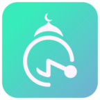

  

# Muslim Prayer

Muslim Prayer is a **Progressive Web App** built using react. This will remind you if the prayer time has come.
**_Don't forget_** to pray **on time** :wink: :v:

## Demo
[Click Here](https://muslim-prayer.netlify.com/)
## Prototype
## Features
- [x] Offline support
- [ ] Time by Location
- [ ] Notification
- [ ] Change Mu'adzin Voice